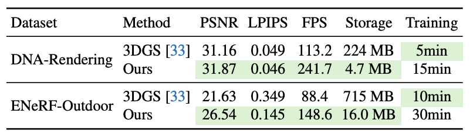
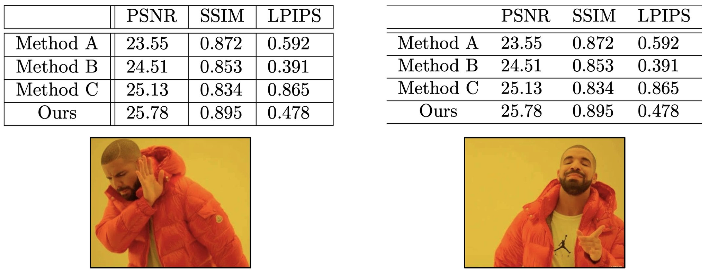
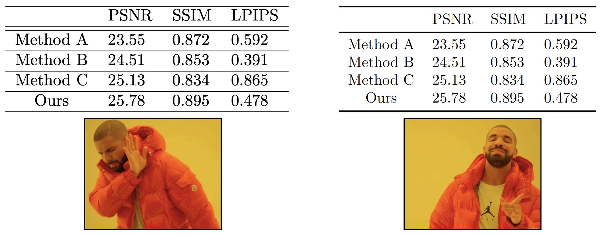
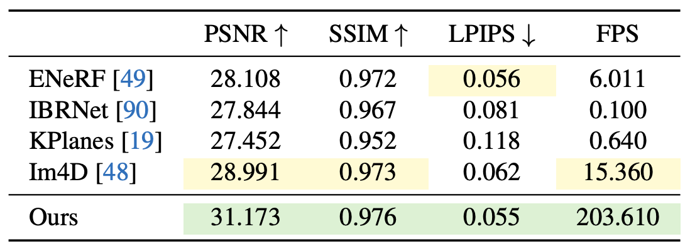

# 图表示例

## 表格目标

- 一张表只表达一个主要信息
- 读者不看正文也能理解数据含义
- 用对齐, 分组和有限高亮建立视觉层级
- 减少墨水, 不减少必要信息

## 好看的结果表




特点:

- 最佳结果和次佳结果使用克制的视觉强调
- 不同方法组之间存在清晰分隔
- 指标方向写在表头
- 不同数据集和设置采用分组表头

## 逐步改进

### 移除竖线



- 避免使用竖线分隔每一列
- 使用留白和对齐表达列关系
- 只在分组边界使用必要横线

### 减少横线



- 不为每一行添加横线
- 横线用于表头, 分组和表尾
- 避免双横线和密集边框

### 突出主要结果



- 只高亮需要读者比较的数字
- 使用粗体, 浅色背景或下划线中的一种或两种
- 不让颜色压过数据本身

## LaTeX 表格骨架

```tex
\begin{table}[t]
    \centering
    \caption{说明实验设置, 数据集, 指标和必要符号}
    \label{tab:main_result}
    \begin{tabular}{lccc}
        \toprule
        Method & Metric A $\uparrow$ & Metric B $\uparrow$ & Metric C $\downarrow$ \\
        \midrule
        Baseline A & -- & -- & -- \\
        Baseline B & -- & -- & -- \\
        \midrule
        Ours & -- & -- & -- \\
        \bottomrule
    \end{tabular}
\end{table}
```

建议使用:

```tex
\usepackage{booktabs}
\usepackage{colortbl,xcolor}
```

需要按小数点对齐时可以使用 `siunitx`

## 表格检查

- 表格说明是否位于表格上方
- 说明是否解释实验设置和符号
- 指标是否标明方向和单位
- 同一指标是否使用一致小数位
- 文本列是否左对齐
- 数值列是否一致对齐
- 是否存在没有信息价值的横线或竖线
- 高亮是否只强调关键结果
- 是否把互不相关的结果塞进同一张表

## 图片检查

- 图片是否直接服务于论文主张
- 字号在最终版面尺寸下是否可读
- 颜色在灰度打印和色觉差异下是否仍能区分
- 图例, 坐标轴和单位是否完整
- 子图顺序是否与正文讨论顺序一致
- 图中的术语是否与正文一致
- 封面图是否突出问题和核心认知
- 技术流程图是否突出真正的新模块

## 来源案例

- [结果表格排版教程](https://x.com/jbhuang0604/status/1626372600824844289)
