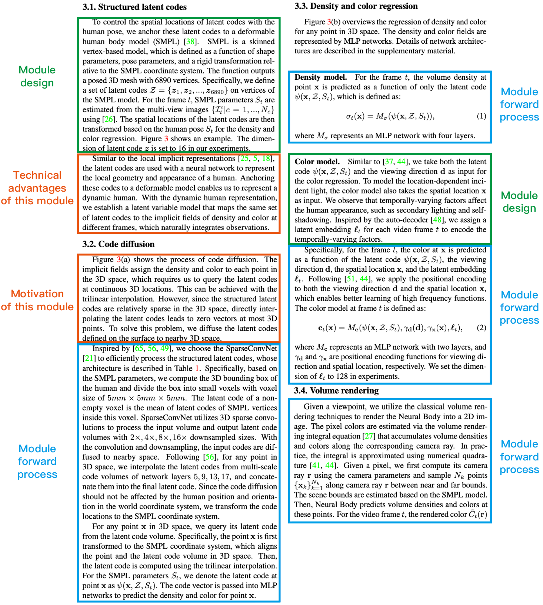

# 方法示例

## 方法章节骨架

```tex
\section{Method}
% Overview
% Module 1
% Module 2
% Module 3
% Implementation details
```

## 概览

概览承担四项职责:

1. 说明问题设置
2. 说明核心贡献
3. 指向技术流程图
4. 说明后续小节分别讨论什么

```tex
% 一到两句话说明输入, 输出和问题设置
% 一到两句话说明核心贡献
% 如果总体流程有必要, 指向对应图片
% Section 3.1 讨论什么
% Section 3.2 讨论什么
% Section 3.3 讨论什么
```

概览不是摘要的重复, 它需要帮助读者建立方法内部结构

## 模块三元素



每个主要模块回答:

### 模块动机

- 当前流程还存在什么问题
- 为什么已有模块无法解决
- 为什么需要新增这一模块

常用骨架:

```text
A remaining challenge is [problem]
Previous designs have difficulty in [condition] because [reason]
To address this issue, we introduce [module]
```

### 模块设计

- 定义表示, 网络或数据结构
- 按严格执行顺序说明前向过程
- 说明输入怎样变为输出
- 说明输出被后续哪个模块使用

```text
We represent [object] with [representation]
Given [input], we first [step 1], then [step 2], and finally [step 3]
This produces [output], which is used for [purpose]
```

### 技术优势

- 与直接替代方案比较
- 解释优势来自什么机制
- 尽量连接到可以测量的行为

```text
Compared with [alternative], the proposed design [mechanism difference]
This allows [advantage], which is evaluated by [experiment / metric]
```

## 模块小节骨架

```tex
\subsection{Module Name}
% 动机和目标问题
% 核心表示或网络定义
% 输入
% 前向步骤一
% 前向步骤二
% 输出和后续用途
% 技术优势
% 必要的训练目标或约束
```

## 实现细节

实现细节用于保证复现, 通常包括:

- 网络层数, 通道数和特征维度
- 优化器, 学习率和训练轮数
- 输入分辨率, 批量大小和采样策略
- 坐标变换, 坐标归一化和单位
- 推理步骤和速度测试条件
- 随机种子和硬件环境
- 训练与推理之间不同的设置

如果某个设置会影响主要结论, 它不应只藏在实现细节中

## 常见问题 PDF 的核心检查项

引用的 `Method 写作常见问题` PDF 与教程正文共同强调:

- 缺少模块动机
- 前向过程跳过关键步骤
- 公式出现前没有定义输入和符号
- 图中的名称与正文不一致
- 用多个近义词指代同一对象
- 只说模块有效, 没有解释为什么有效
- 实现细节不足, 导致方法无法复现
- 句子之间没有说明为什么需要下一步

## 逐层检查

### 章节层

- 小节顺序是否与技术流程一致
- 每个小节是否对应明确模块
- 概览能否预测后续结构

### 段落层

- 第一说明确段落职责
- 一个段落只处理一个模块问题
- 动机, 设计和优势没有相互混杂

### 句子层

- 每个符号第一次出现时已经定义
- 每一步都有输入和输出
- 下一句与上一句存在明确关系
- 所有术语在全文保持一致

## 自检

- 读者能否只根据方法章节复现核心流程
- 每个模块是否回答为什么需要, 怎样运行和为什么有效
- 是否区分核心贡献与常规工程实现
- 所有优势是否能够由实验验证
- 是否有图中存在但正文未解释的模块
