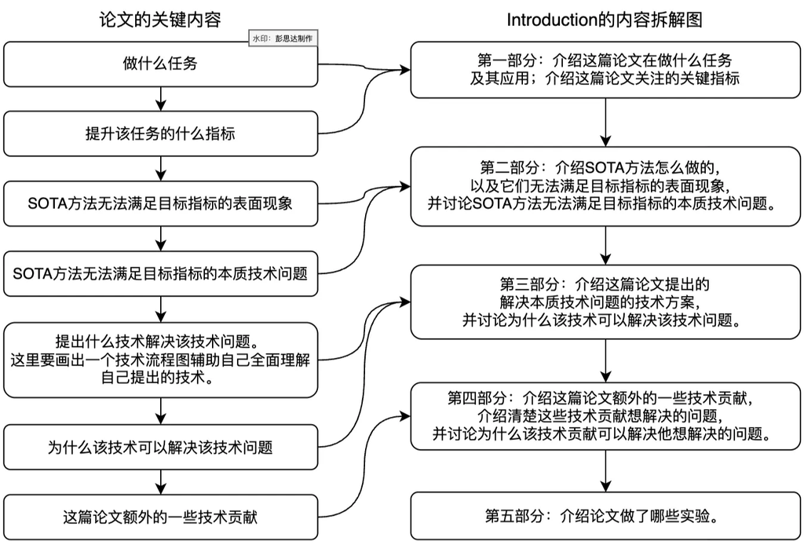
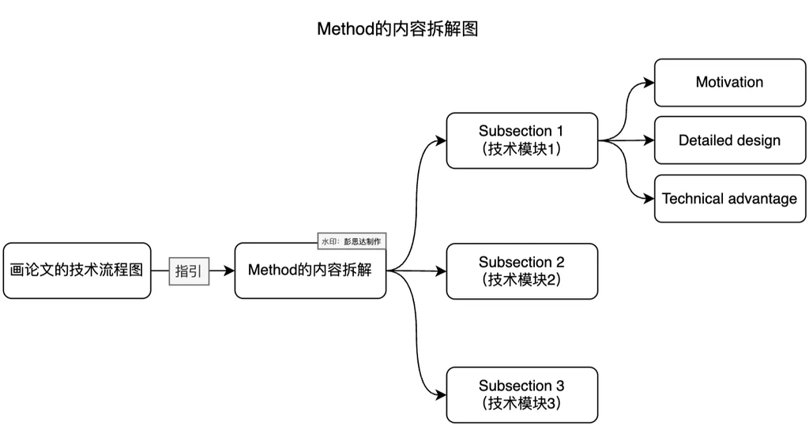
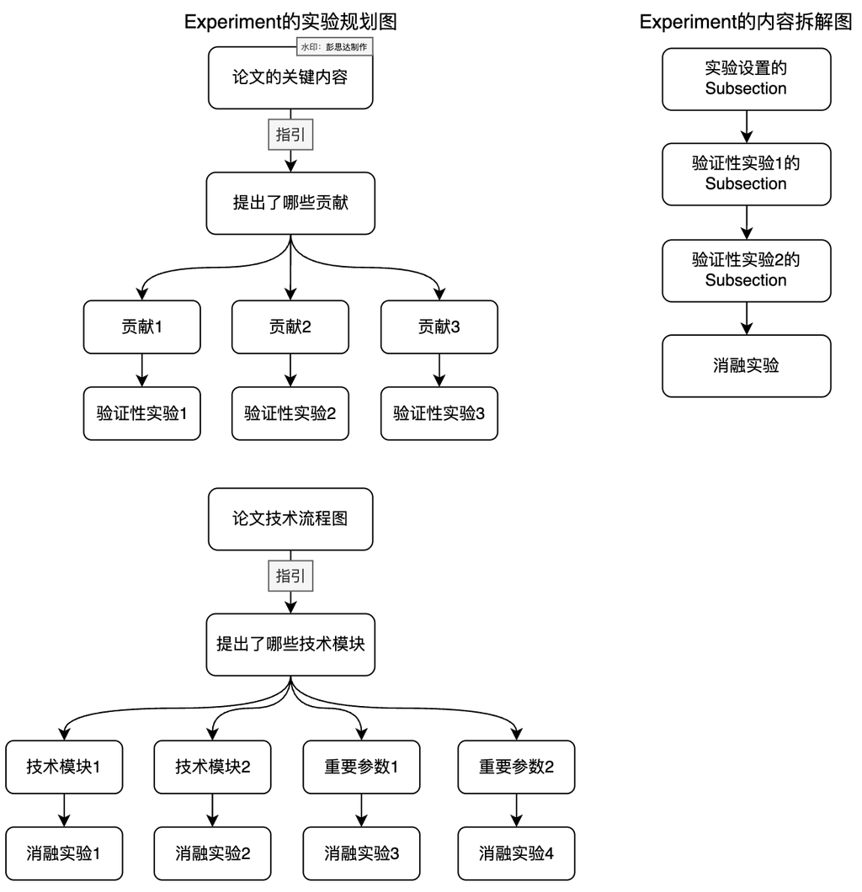

# 论文写作

## 参考资料

- [论文写作模板](https://pengsida.notion.site/c1a22465a0fa4b15a12985223916048e)
- [原教程资料仓库](https://github.com/pengsida/learning_research)
- [智能代理写作技能整理](https://github.com/Master-cai/Research-Paper-Writing-Skills)
- [如何使用 Copilot 和 GPT 辅助英语写作](https://pengsida.notion.site/p/1143fe292ff180feb5d0fe76d05e085b?pvs=25)
- [智能代理辅助写作录屏](https://www.bilibili.com/video/BV1jdxDeZEtq)
- [如何改一篇论文的写作](https://pengsida.notion.site/p/1293fe292ff180bfa5deeed526821d78?pvs=25)
- [高水平科研工作者的写作经验](https://pengsida.notion.site/p/74aef88b9187439fa4e301704f6eb49a)
- [怎么做吸引人的演示和应用](https://pengsida.notion.site/demo-application-d820794145a041be9599e45dc0cdb3b5?pvs=25)
- [怎么审论文](https://pengsida.notion.site/eed9ed1e9dc44a1c9437b114e6d5d9fd?pvs=25)
- [科研画图素材库, 原页面尚未公开](https://pengsida.notion.site/2bd4d371117a45e1af4021ccc25e0515?pvs=25)

## 中英对照

| 英文 | 中文 |
|---|---|
| Task | 任务 |
| Application | 应用 |
| Setting | 问题设置 |
| Story | 叙事逻辑 |
| Technical challenge | 技术问题 |
| Technical reason | 技术原因 |
| Limitation | 局限 |
| Failure case | 失败场景 |
| Contribution | 贡献 |
| Insight | 核心认知 |
| Claim | 主张 |
| Evidence / Support | 证据 / 支持 |
| Pipeline / Framework | 技术流程 / 框架 |
| Module / Component | 模块 / 组件 |
| Module design | 模块设计 |
| Motivation | 动机 |
| Technical advantage | 技术优势 |
| Overview | 概览 |
| Implementation details | 实现细节 |
| Experiment | 实验 |
| Comparison experiment | 对比实验 |
| Ablation study | 消融实验 |
| Baseline | 基线方法 |
| Variant | 方法变体 |
| Metric | 评价指标 |
| Performance | 实验表现 |
| State of the art / SOTA | 当前最佳水平 |
| Experimental protocol | 实验协议 |
| Related work | 相关工作 |
| Future work | 后续工作 |
| Caption | 图表说明 |
| Teaser figure | 封面图 / 引导图 |
| Pipeline figure | 技术流程图 |
| Reviewer | 审稿人 |
| Reverse outlining | 反向列提纲 |
| Flow | 衔接与连贯性 |
| Self-contained | 信息自足 |

## 关键点

### 智能代理时代的写作方式

- 写作不再遵循强时间顺序
- 论文结构, 方法描述, 实验设计, 图表草稿和相关工作可以并行推进
- 没有实验结果时可以先写章节骨架, 方法事实, 实验协议和待验证主张
- 没有证据时不能写确定的结果, 数值, 排名或强结论
- 智能代理生成的完整文章只是候选草稿, 不是已经完成的论文
- 对没有证据的内容使用明确标记, 例如 `[待实验]`, `[待核对]`, `[待引用]`
- 新结果出现后同步更新摘要, 引言, 实验和结论中的相关主张

建议维护主张与证据的对应关系:

| 主张 | 所需证据 | 当前状态 | 处理方式 |
|---|---|---|---|
| 方法优于已有方法 | 公平的对比实验 | 待实验 | 暂不写确定结论 |
| 模块带来主要提升 | 对应消融实验 | 待实验 | 保留为待验证假设 |
| 方法在困难场景下更稳定 | 压力测试或困难数据 | 待实验 | 先设计实验协议 |
| 方法具有某项机制优势 | 推导, 分析或受控实验 | 部分支持 | 限定主张范围 |

### 表达原则

- 一段文字讲且只讲一个信息
- 一段开头的第一句直接说明这段在讨论什么
- 每个后续句子都应该解释, 证明, 细化或限制首句
- 一句话出现的新名词不能依赖作者脑中的隐藏背景
- 同一个概念在全文使用同一个名称和符号
- 不依赖堆积衔接词制造表面连贯, 先保证句子之间真的存在逻辑关系

句间关系通常包括:

- 原因和结果
- 问题和解决方案
- 一般情况和具体情况
- 观点和证据
- 对比和让步
- 结论和限制条件

### 检查衔接与清晰度

引用的 `Does My Writing Flow` PDF 的核心方法如下:

1. 假装自己是第一次看到论文的读者
2. 检查读者是否能理解词汇, 术语和每一步推理
3. 对已经写好的内容反向列提纲
4. 写出总主张, 每段首句和每段证据
5. 检查每段首句是否服务于总主张
6. 检查每条证据是否服务于对应段落
7. 草稿阶段可以临时增加小标题, 借此暴露章节边界和逻辑断点
8. 只有关系明确时才添加表示因果, 对比, 举例或总结的衔接词

如果很难为现有文字列出简洁的反向提纲, 通常说明章节逻辑或段落主题仍然不清楚

### 视觉质量

- 把视觉质量视为论文内容的一部分
- 封面图, 技术流程图, 结果图和表格共同决定论文的第一印象
- 图表需要直接突出贡献, 差异和主要结果
- 排版保持整齐, 克制和一致
- 不用复杂装饰掩盖技术关系

### 反复修改

- 先把原始文字压缩为高层写作思路
- 检查该思路是否表达了真正想说的内容
- 检查相邻思路是否连续
- 修改高层思路后再重新展开为文字
- 对每两个相邻句子检查第二句是否承接第一句
- 如果第二句引入新名词, 检查它是否出现得过于突然
- 写完章节后再次反向列提纲, 不只修改局部用词

### 主张与证据

- 摘要和引言中的每个重要主张都需要实验或分析支持
- 证据不足时补实验, 缩小主张范围或删除主张
- 不能只凭机制直觉推出实验结论
- 对比必须采用公平的数据, 预处理, 训练预算和评价协议
- 同时报告主要优势, 适用边界和重要失败场景

### 自我评审

从审稿人的角度检查五个方面:

1. 贡献是否给读者带来新知识
2. 写作是否清楚并足以复现
3. 实验提升是否有意义并且稳定
4. 对比, 消融, 指标和数据是否充分
5. 方法设计是否合理, 鲁棒且收益大于代价

对每个问题标记 `通过`, `需要修改` 或 `需要新实验`, 然后根据没有通过的项目继续修改

## 准备

### 论文事实表

开始扩写正文前先回答:

- 论文解决什么任务
- 输入和输出分别是什么
- 该任务服务于哪些应用
- 最需要改善什么指标
- 当前方法在哪些场景下无法满足目标指标
- 产生失败的本质技术原因是什么
- 核心认知是什么
- 创新点和贡献分别是什么
- 每项贡献如何实现核心认知
- 方法为什么能够工作
- 相对于已有方法有什么技术优势
- 适用范围和已知边界是什么

这些问题可以在实验之前先形成候选答案, 但所有经验性结论都必须在实验完成后重新核对

### 方法准备

- 画技术流程图草稿
- 列出方法中的所有模块
- 为每个模块回答三个问题
    - 为什么需要这个模块
    - 这个模块具体怎样运行
    - 这个模块为什么具有技术优势
- 明确每个模块的输入, 中间状态和输出
- 明确模块之间的数据流和依赖关系
- 区分核心贡献, 常规实现和仅用于工程稳定性的设计

### 实验准备

- 每个核心主张对应至少一项验证证据
- 每项贡献对应一组验证实验
- 每个重要模块和设计选择对应消融实验
- 选择相关且较新的强基线方法
- 确保数据划分, 预处理和评价方式公平
- 设计更困难的数据或压力测试, 展示方法上限和边界
- 提前规划图表, 避免实验结束后才发现结果无法清楚表达

### 相关工作准备

- 先列出最接近自己的方法和强基线
- 再按研究问题和技术路线划分主题
- 对每个主题总结共同范式, 与本文有关的局限和本文差异
- 不按年份机械罗列论文
- 不回避最强或最接近的竞争方法

## 结构

### 封面图

- 让读者在阅读正文前理解论文解决的问题和核心差异
- 优先展示问题, 核心认知, 方法效果或应用价值
- 不必塞入整个技术流程的所有细节
- 图中的视觉重点应当与论文最重要的贡献一致
- 确保缩小到论文版面尺寸后仍然清晰

### 架构图

- 技术流程图用于突出新模块和技术关系
- 文字部分负责让读者完整理解方法
- 如果总体流程并不新, 应当突出真正有贡献的模块
- 图中标明输入, 关键中间状态, 模块和输出
- 图中的名称与正文保持一致
- 不为了显得复杂而增加没有解释价值的箭头和方框

### 标题

- 标题可能吸引不同领域的审稿人
- 先写下任务, 技术, 问题和核心认知等关键词
- 标题和方法短语需要有具体含义
- 优先让读者知道使用的技术, 论文任务或解决的问题
- 避免只有项目名称而没有信息的标题
- 避免超出实验支持范围的强主张

### 摘要

写摘要前回答:

- 我们解决的技术问题是什么
- 为什么已有方法没有成熟有效的解法
- 技术贡献是什么
- 方法本质上为什么能够工作
- 技术优势和新认知是什么
- 哪些实验结果可以支持上述主张

常用节奏:

1. 任务
2. 已有方法的技术问题
3. 解决问题的核心认知或技术贡献
4. 技术贡献的优势
5. 实验结论

```tex
\section{Abstract}
% 任务
% 已有方法的技术问题和技术原因
% 解决问题的核心认知或技术贡献
% 技术优势
% 有证据支持的实验结论
```

摘要可以采用三种组织方式:

- 技术问题 -> 技术贡献
- 技术问题 -> 核心认知 -> 技术贡献
- 多项技术贡献 -> 分别说明每项贡献的技术优势

详见 [摘要示例](示例/摘要.md)

### 引言

写引言前先倒推:

1. 我们解决什么技术问题, 为什么它没有成熟有效的解法
2. 我们提出什么贡献
3. 这些贡献为什么能够解决技术问题
4. 这些贡献带来什么技术优势和新认知
5. 应该怎样介绍已有方法, 才能自然引出目标技术问题

然后正推论文叙事:

1. 介绍任务和应用
2. 通过已有方法引出目标技术问题和技术原因
3. 介绍解决问题的方法和贡献
4. 说明技术优势和新认知
5. 用实验概述和贡献列表收束



```tex
\section{Introduction}
% 任务和应用
% 已有方法的技术问题
% 产生问题的技术原因
% 解决问题的方法和技术流程
% 方法为什么有效以及技术优势
% 实验概述
% 贡献列表
```

注意:

- 围绕自己真正解决的问题介绍已有方法
- 不要先虚构一个过于简单的方案, 再把方法写成逐步打补丁
- 不要只讲抽象认知而隐藏具体做法
- 引言应当让读者理解核心贡献怎样实现, 但不展开全部实现细节
- 贡献列表需要与正文和实验一一对应

详见 [引言示例](示例/引言.md)

### 相关工作

- 先列出与本文直接竞争或最相关的方法
- 根据研究问题和技术路线划分两到四个主题
- 每个主题先说明范围, 再概括代表方法
- 讨论与本文目标技术问题有关的假设, 局限和失败场景
- 在段落结尾说明本文与该路线的技术差异
- 相关工作不是引用列表, 也不是用来回避强基线的地方

段落节奏:

1. 定义本段讨论的技术路线
2. 概括代表方法的共同做法
3. 指出与本文问题有关的限制
4. 说明本文在机制, 假设或适用范围上的差异

### 方法

先根据技术流程图拆分小节, 每个主要模块占一个小节



```tex
\section{Method}
% Overview
% Module 1
% Module 2
% Module 3
% Implementation details
```

方法概览通常包括:

- 一到两句话说明问题设置
- 一到两句话说明核心贡献
- 指向技术流程图
- 说明后续各小节分别讨论什么

每个模块采用三个部分:

1. 模块动机: 为什么需要该模块
2. 模块设计: 给定输入后怎样经过明确步骤得到输出
3. 技术优势: 为什么该设计优于直接替代方案

实现细节包括:

- 网络层数和特征维度
- 数据结构和表示方法
- 坐标变换和归一化
- 训练, 推理和数值稳定性有关的设置
- 复现所需但不属于核心贡献的工程细节

方法检查:

- 是否缺少模块动机
- 是否存在步骤跳跃或句间断裂
- 是否遗漏复现所需的实现细节
- 术语和符号是否一致
- 每句话是否让读者知道为什么需要这部分内容

详见 [方法示例](示例/方法.md)

### 实验

实验需要回答三个问题:

1. 方法是否优于强基线
2. 哪些模块和设计选择产生了提升
3. 方法在更困难的设置下能做到什么程度



建议结构:

```tex
\section{Experiments}
% 实验设置
% 对比实验
% 分项验证实验
% 消融实验
% 困难场景和失败分析
```

对比实验:

- 选择相关且较新的强基线
- 统一数据划分, 预处理, 训练预算和评价协议
- 对新任务没有直接基线时, 构造合理的方法变体和替代方案
- 不只报告最有利于自己的指标

消融实验:

- 使用一个总表展示所有核心贡献的影响
- 使用若干小表分别验证模块内部的设计选择
- 必要时验证模块交互, 超参数敏感性和输入质量敏感性
- 为重要消融提供对应的可视化结果

演示和应用:

- 面向下游研究群体选择有价值的场景
- 在更困难或分布外数据上寻找方法上限
- 同时展示潜力和失败边界
- 可交互演示有助于读者理解实际效果

图表说明:

- 表格说明放在表格上方
- 图表说明写清实验设置, 符号和评价协议
- 正文负责解释结果, 图表说明不要重复大段讨论
- 两栏论文中的单栏图表优先考虑右栏, 避免打断页面左上方的阅读入口

详见 [实验示例](示例/实验.md) 和 [图表示例](示例/图表.md)

### 结论

结论通常包括:

1. 重新说明解决的问题和核心技术认知
2. 概括最有代表性的实验证据
3. 总结实际价值或新知识
4. 说明局限
5. 给出具体后续方向

区分两类问题:

- 技术缺陷: 在关键指标上弱于强基线, 或引入不可接受的代价
- 范围局限: 受当前任务设置约束, 但在相同设置下仍然具有竞争力

不要把严重的技术缺陷包装成普通后续工作, 也不要因为害怕暴露局限而完全不讨论适用范围

详见 [结论示例](示例/结论.md)
